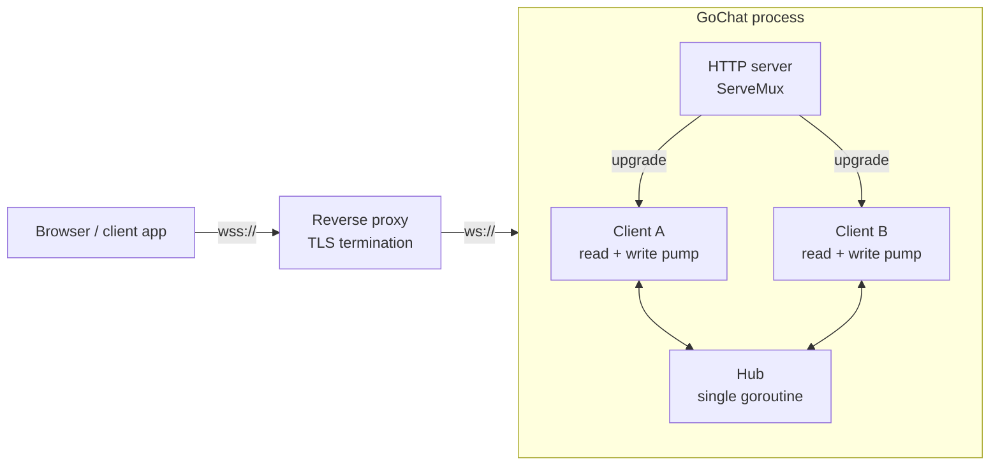
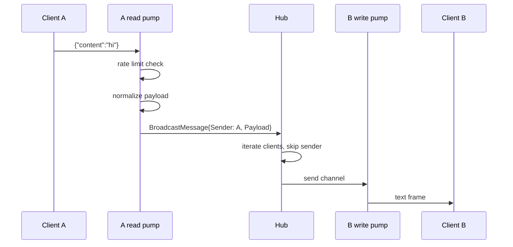

# Architecture Overview

GoChat is a single-process, in-memory WebSocket broadcast server: one binary, one dependency
(`gorilla/websocket`), no database, no message history, no authentication. Everything below explains
how the pieces fit and why they are shaped that way.

## System context



The proxy is not optional in production: the process speaks plain HTTP and has no authentication.
See [Deploying to production](../guides/deploying-to-production.md).

## Code layout

```
cmd/server/main.go          Entry point: config → hub → routes → HTTP server → signal handling
internal/server/
  config.go                 Env parsing, defaults, sanitization, the atomic config snapshot
  logging.go                Structured log/slog logger and LOG_LEVEL handling
  routes.go                 ServeMux wiring for /, /ws, /test
  handlers.go               Upgrade handler, health handler, embedded test page
  testpage.html             The /test page, compiled into the binary with go:embed
  http_server.go            http.Server construction, start/stop, global hub accessor
  hub.go                    Client registry, broadcast fan-out, shutdown coordination
  client.go                 Per-connection read and write pumps
  origin.go                 Origin normalization and allow-list checks
  rate_limiter.go           Per-connection token bucket
  types.go                  Message payloads and the JSON normalizer
test/                       Unit and integration suites (see guides/testing.md)
```

`internal/` means the packages cannot be imported by other modules — this is an application, not a
library. The `server` package is deliberately flat: every file declares `package server`, and the
package comment on each file describes that file's slice of responsibility.

## Components

**Hub** (`hub.go`) — owns the set of connected clients. A single goroutine runs `Hub.Run`, selecting
over four channels: `register`, `unregister`, `broadcast`, and `shutdown`.

That goroutine is the *sole* owner of the client map: registration, unregistration, fan-out, and
shutdown all happen inside `Run`, so the map needs no lock at all. Broadcasts iterate the map
directly instead of copying it, and the slice of failed clients is scratch space reused across
messages, which makes the fan-out path allocation-free. The rule that keeps this sound is simple:
every mutation of the client set must arrive through one of the hub's channels.

**Client** (`client.go`) — one per connection, with two goroutines:

- *read pump* — reads frames, enforces the rate limit, normalizes the payload, and hands it to
  the hub's broadcast channel. Exits on any read error and unregisters the client.
- *write pump* — selects over the client's 256-message `send` channel, a 54-second ping ticker, and
  the hub's shutdown channel. Coalesces anything already queued into the current frame, separated by
  newlines, so a burst costs one frame rather than one per message.

Splitting reads and writes is required by `gorilla/websocket`: at most one concurrent reader and one
concurrent writer are allowed per connection.

**Rate limiter** (`rate_limiter.go`) — a token bucket per connection, embedded in the `Client` by
value. Tokens refill continuously from elapsed time rather than on a timer, so there is no background
goroutine and no allocation per client. It carries no mutex because only that connection's read pump
ever touches it; sharing a limiter across goroutines would be a bug.

**Origin validation** (`origin.go`) — normalizes the `Origin` header to lowercase `scheme://host` and
looks it up in a set built once at startup. Wired into the upgrader as `CheckOrigin`, so rejection
happens before any connection resources are allocated. Headers that are already canonical — which is
what browsers send — match the set directly and skip URL parsing entirely. A request with no `Origin`
header is always rejected, even when the allow-list contains `*`.

**Config** (`config.go`) — parsed from the environment at startup, sanitized, and published as an
immutable snapshot in an `atomic.Pointer`. Readers on the connection path load the pointer without
locking; `SetConfig` swaps in a whole new snapshot rather than mutating the live one. `SetConfig(nil)`
restores defaults, which is what the tests use. Invalid values never abort startup; they log and fall
back.

**Logging** (`logging.go`) — a single `log/slog` logger shared by the package, its level read from
`LOG_LEVEL`. Per-message records are emitted at debug level and guarded by a cached level check, so
at the default `info` level a busy server does no logging work per message.

## Message flow



Two consequences fall out of this design:

- **The sender never receives its own message.** `BroadcastMessage` carries the sender so the hub can
  skip it. Clients that want a local echo must add it themselves.
- **Payloads are normalized.** Every frame is re-encoded into exactly `{"content":...}`, so unknown
  fields are dropped, clients cannot smuggle extra data through, and a message missing `content` is
  relayed as `{"content":""}`. A frame that already *is* in that canonical form — the common case —
  is detected with a single scan and copied through without a JSON round trip. Anything else falls
  back to decode-and-re-encode. Both paths produce byte-identical output, which is pinned by a
  property test against `encoding/json`.

### Backpressure

Fan-out is a non-blocking send into each client's 256-slot buffer. If the buffer is full, the
client is dropped rather than allowed to stall the hub — one slow consumer cannot block the broadcast
loop for everyone. The trade-off is that a client on a bad network loses its connection instead of
its messages being queued indefinitely.

## Lifecycle

**Startup** (`main.go`): read config → apply it globally → start the hub goroutine → build the mux →
construct `http.Server` with 15s read/write and 60s idle timeouts → `ListenAndServe` in a goroutine →
block on either a server error or `SIGINT`/`SIGTERM`.

**Shutdown**, on signal, in strict order with a 30-second overall cap:

1. `http.Server.Shutdown` (15s budget) — stops accepting connections and drains in-flight requests.
2. `Hub.Shutdown` (15s budget) — closes the `shutdown` channel, which stops the run loop, closes
   every client connection, and waits on the `WaitGroup` for all pumps to exit.

The `shutdown` channel appears in every blocking select in the codebase — registration, broadcast,
and the write pump — so nothing can block shutdown by waiting on a channel nobody will read.

## Concurrency model

| Goroutine        | Count            | Lifetime                       |
| ---------------- | ---------------- | ------------------------------ |
| `Hub.Run`        | 1                | Process lifetime               |
| Client read pump | 1 per connection | Until read error or shutdown   |
| Client write pump| 1 per connection | Until send closed or shutdown  |
| `ListenAndServe` | 1                | Process lifetime               |

Roughly two goroutines and a 256-message buffer per connection. The whole suite runs under `-race`
in CI because this is where the risk lives.

## Performance

The hot paths are the ones that run per message, and all three are allocation-free or close to it.
Measured with `make bench` on an AMD Ryzen 7 7800X3D; treat the absolute numbers as machine-specific
and the allocation counts as the durable part.

| Path                                | Cost                    | Notes                                        |
| ----------------------------------- | ----------------------- | -------------------------------------------- |
| Broadcast fan-out, 1000 clients     | ~35 us, 0 allocs        | No lock, no per-message client snapshot       |
| Message normalization, canonical    | ~46 ns, 1 alloc         | Scan and copy; no JSON round trip             |
| Message normalization, slow path    | ~590 ns, 8 allocs       | `encoding/json` decode plus hand-rolled encode |
| Rate limit check                    | ~6 ns, 0 allocs         | Lock-free token bucket                        |
| Origin check, canonical header      | ~23 ns, 0 allocs        | Set lookup before any URL parsing             |

The single remaining allocation per message is the normalized payload itself, which is shared by
reference with every receiving client rather than copied per recipient. Write buffers are pooled
across connections by `gorilla/websocket`, so memory per idle connection stays close to the 256-slot
send channel.

Two decisions do more for throughput than any of the micro-optimizations above: per-message logging
only happens at debug level, and the write pump coalesces everything already queued into a single
frame.

## Design trade-offs

**Global hub and global config.** `GetHub()` and the package-level config snapshot are process-wide
singletons. This keeps `main.go` to a hundred lines, at the cost of testability — the test suite
works around it with `SetupRoutesWithHub` and `SetConfig`. Threading a `*Hub` and `*Config` through
explicitly would be the natural refactor if the server ever grows a second hub (rooms, namespaces).

**No message history, no persistence.** Nothing is stored, so there is no database, no migration
path, and no state to back up. A client that reconnects starts from silence.

**Single instance only.** The hub lives in process memory, so two instances behind a load balancer
form two disconnected chat rooms. Horizontal scaling would require an external bus (Redis pub/sub,
NATS) between the hubs.

**Drop rather than queue.** Both the rate limiter (drops messages) and the send buffer (drops
clients) fail fast instead of buffering. This bounds memory under load but makes message delivery
best-effort, with no acknowledgement in the protocol.

**Structured logging without request IDs.** `log/slog` gives levels and key-value attributes, but
there is no correlation ID tying a client's frames together across records. Adding one would mean
threading a connection ID through the pumps.

## Related

- [API reference](../reference/api.md) — the externally visible contract
- [Configuration reference](../reference/configuration.md) — every tunable and every constant
- [Testing](../guides/testing.md) — how the concurrency guarantees are exercised
- [Contributing](../contributing.md) — working in this codebase
