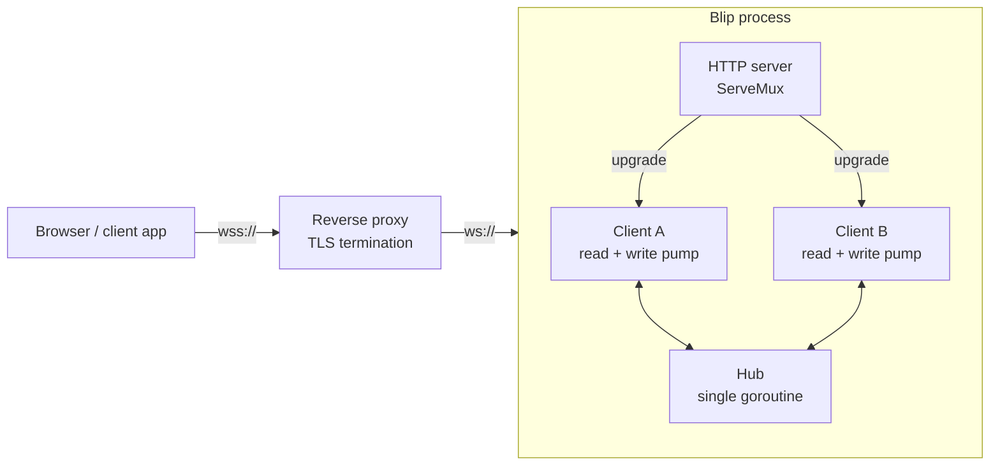
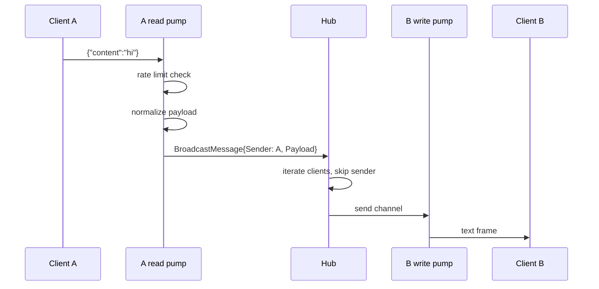

# Architecture Overview

Blip is a single-process, in-memory WebSocket broadcast server: one binary, one dependency
(`gorilla/websocket`), no database, no message history, no authentication. Everything below explains
how the pieces fit and why they are shaped that way.

## System context



The proxy is not optional in production: the process speaks plain HTTP and has no authentication.
See [Deploying to production](../guides/deploying-to-production.md).

## Code layout

```
cmd/server/main.go          Entry point: logger, config, signal handling, Service.Run
internal/server/
  service.go                The service lifecycle: build, run, and drain in order
  config.go                 Env parsing, defaults, sanitization, the resolved config a hub owns
  logging.go                Structured log/slog logger and LOG_LEVEL handling
  routes.go                 ServeMux wiring for /, /ws, /test
  handlers.go               Upgrade handler, health handler, embedded test page
  testpage.html             The /test page, compiled into the binary with go:embed
  hub.go                    Client registry, broadcast fan-out, shutdown coordination
  client.go                 Per-connection read and write pumps
  origin.go                 Origin normalization and allow-list checks
  rate_limiter.go           Per-connection token bucket
  types.go                  Message payloads exchanged over the wire
  close_errors.go           Tells ordinary connection teardown from a real fault
  message_json.go           The wire-format encoder, kept identical to encoding/json
test/                       Unit and integration suites (see guides/testing.md)
```

`internal/` means the packages cannot be imported by other modules — this is an application, not a
library. The `server` package is deliberately flat: every file declares `package server`, and the
package comment on each file describes that file's slice of responsibility.

## Components

**Service** (`service.go`) — the whole running server behind two functions. `New(cfg)` builds the
hub, the routes bound to it, and the `http.Server` that fronts them; `Run(ctx)` starts them and
drains them when `ctx` is cancelled. Nothing else is exported from the lifecycle, so the shutdown
ordering below cannot be got wrong by a caller — including a test, which is why the tests drive the
real thing rather than a copy of it.

**Hub** (`hub.go`) — owns the set of connected clients and the configuration they run under.
`NewHub(cfg)` resolves the configuration once and keeps it, so the origin allow-list, the message
size limit, and the rate limit belong to that hub rather than to the process. A single goroutine
runs `Hub.Run`, selecting over five channels: `register`, `unregister`, `broadcast`, `countReq`,
and `shutdown`.

That goroutine is the *sole* owner of the client map: registration, unregistration, fan-out, and
shutdown all happen inside `Run`, so the map needs no lock at all. Broadcasts iterate the map
directly instead of copying it, and the slice of failed clients is scratch space reused across
messages, which makes the fan-out path allocation-free. The rule that keeps this sound is simple:
every mutation of the client set must arrive through one of the hub's channels.

Reads obey the same rule. `ClientCount()` sends a reply channel down `countReq` and lets `Run`
answer it, rather than reading the map from the caller's goroutine. Because `Run` is sequential, a
reply also proves everything queued before the request has already been processed — which is what
makes it a usable synchronization barrier in tests.

**Client** (`client.go`) — one per connection, with two goroutines:

- *read pump* — reads frames, enforces the rate limit, normalizes the payload, and hands it to
  the hub's broadcast channel. Exits on any read error and unregisters the client.
- *write pump* — selects over the client's 256-message `send` channel, a 54-second ping ticker, and
  the hub's shutdown channel. Coalesces anything already queued into the current frame, separated by
  newlines, so a burst costs one frame rather than one per message.

Splitting reads and writes is required by `gorilla/websocket`: at most one concurrent reader and one
concurrent writer are allowed per connection.

**Rate limiter** (`rate_limiter.go`) — a token bucket per connection, embedded in the `Client` by
value. Tokens refill continuously from elapsed time rather than on a timer, so there is no background
goroutine and no allocation per client. It carries no mutex because only that connection's read pump
ever touches it; sharing a limiter across goroutines would be a bug.

**Origin validation** (`origin.go`) — normalizes the `Origin` header to lowercase `scheme://host` and
looks it up in a set built once when the hub is constructed. It is a method on that hub's resolved
configuration, bound into the hub's own upgrader as `CheckOrigin`, so rejection happens before any
connection resources are allocated. Headers that are already canonical — which is what browsers send
— match the set directly and skip URL parsing entirely. A request with no `Origin` header is always
rejected, even when the allow-list contains `*`.

**Config** (`config.go`) — parsed from the environment at startup into a `Config`, then resolved once
by `NewHub`: defaults substituted for anything invalid, the allow-list normalized into a lookup set.
The result is a value the hub owns and never mutates, so readers on the connection path need neither
a lock nor an atomic load, and two hubs in one process can be configured differently. The caller's
`Config` is copied on the way in, so changing it afterwards cannot change a running hub. Invalid
values never abort startup; they log and fall back.

**Logging** (`logging.go`) — a single `log/slog` logger shared by the package, its level read from
`LOG_LEVEL`. Per-message records are emitted at debug level behind a `debugEnabled()` check, so at
the default `info` level a busy server skips work that exists only to be logged — slog cannot do
that itself, because arguments are evaluated before it sees them.

## Message flow



Two consequences fall out of this design:

- **The sender never receives its own message.** `BroadcastMessage` carries the sender so the hub can
  skip it. Clients that want a local echo must add it themselves.
- **Payloads are normalized.** Every frame is re-encoded into exactly `{"content":...}`, so unknown
  fields are dropped, clients cannot smuggle extra data through, and a message missing `content` is
  relayed as `{"content":""}`. A frame that already *is* in that canonical form — the common case —
  is detected with a single scan and copied through without a JSON round trip. Anything else falls
  back to decode-and-re-encode. Both paths produce byte-identical output, which is pinned by a
  property test against `encoding/json`.

### Backpressure

Fan-out is a non-blocking send into each client's 256-slot buffer. If the buffer is full, the
client is dropped rather than allowed to stall the hub — one slow consumer cannot block the broadcast
loop for everyone. The trade-off is that a client on a bad network loses its connection instead of
its messages being queued indefinitely.

## Lifecycle

`main` supplies the logger, the config, and a context cancelled on `SIGINT`/`SIGTERM`, then calls
`Run`. It holds no lifecycle logic of its own, so the ordering below is reachable from a test.

**Startup** (`New`, then `Run`): `New` hands the config to the hub, which resolves and keeps it,
builds the mux, and constructs the `http.Server` with 15s read/write and 60s idle timeouts. `Run` starts the hub
goroutine, calls `ListenAndServe` in a goroutine, and blocks on either a listener error or the
context being done.

**Shutdown**, on cancellation, in strict order with a 30-second overall cap. `Run` builds one
`context.Context` carrying that cap and derives a 15-second child for each stage, so a stage that
overruns cannot borrow the other's budget:

1. `http.Server.Shutdown` (15s context) — stops accepting connections and drains in-flight requests.
   Upgraded WebSocket connections are hijacked, so this stage does not wait on them.
2. `Hub.Shutdown` (15s context) — closes the `shutdown` channel, which stops the run loop, closes
   every client connection, and waits on the `WaitGroup` for all pumps to exit. Both of those waits
   share the one 15-second deadline.

The two errors are joined rather than short-circuited, so a hub that overran is still reported when
the HTTP stage failed too.

The `shutdown` channel appears in every blocking select in the codebase — registration, broadcast,
and the write pump — so nothing can block shutdown by waiting on a channel nobody will read.

## Concurrency model

| Goroutine        | Count            | Lifetime                       |
| ---------------- | ---------------- | ------------------------------ |
| `Hub.Run`        | 1                | Process lifetime               |
| Client read pump | 1 per connection | Until read error or shutdown   |
| Client write pump| 1 per connection | Until send closed or shutdown  |
| `ListenAndServe` | 1                | Process lifetime               |

Roughly two goroutines and a 256-message buffer per connection. The whole suite runs under `-race`
in CI because this is where the risk lives.

## Performance

The hot paths are the ones that run per message, and all three are allocation-free or close to it.
Measured with `make bench` on an AMD Ryzen 7 7800X3D; treat the absolute numbers as machine-specific
and the allocation counts as the durable part.

| Path                                | Cost                    | Notes                                        |
| ----------------------------------- | ----------------------- | -------------------------------------------- |
| Broadcast fan-out, 1000 clients     | ~35 us, 0 allocs        | Includes draining all 999 receivers; see below |
| Message normalization, canonical    | ~46 ns, 1 alloc         | Scan and copy; no JSON round trip             |
| Message normalization, slow path    | ~590 ns, 8 allocs       | `encoding/json` decode plus hand-rolled encode |
| Rate limit check                    | ~6 ns, 0 allocs         | Lock-free token bucket                        |
| Origin check, canonical header      | ~23 ns, 0 allocs        | Per handshake, not per message                 |

The fan-out figure is conservative: `BenchmarkHubBroadcast` drains every receiver inside the timed
loop, because a benchmark outruns any consumer goroutine and the hub would otherwise start evicting
clients mid-measurement. Real fan-out is cheaper than the number suggests.

The single remaining allocation per message is the normalized payload itself, which is shared by
reference with every receiving client rather than copied per recipient. Write buffers are pooled
across connections by `gorilla/websocket`, so memory per idle connection stays close to the 256-slot
send channel.

Two decisions do more for throughput than any of the micro-optimizations above: per-message logging
only happens at debug level, and the write pump coalesces everything already queued into a single
frame.

## Design trade-offs

**Nothing configurable is global.** The hub belongs to a `Service` and the configuration belongs to
the hub, so a process can run as many services as it likes with different origin rules and different
limits — which is what lets every test have a real server of its own and run alongside the others.
What is still process-wide is deliberately not configurable per hub: the logger, and the
`sync.Pool` of write buffers that keeps memory flat as connections accumulate. The cost is that a
hub's settings are fixed once it is built; changing them means building another one.

**No message history, no persistence.** Nothing is stored, so there is no database, no migration
path, and no state to back up. A client that reconnects starts from silence.

**Single instance only.** The hub lives in process memory, so two instances behind a load balancer
form two disconnected chat rooms. Horizontal scaling would require an external bus (Redis pub/sub,
NATS) between the hubs.

**Drop rather than queue.** Both the rate limiter (drops messages) and the send buffer (drops
clients) fail fast instead of buffering. This bounds memory under load but makes message delivery
best-effort, with no acknowledgement in the protocol.

**Structured logging without request IDs.** `log/slog` gives levels and key-value attributes, but
there is no correlation ID tying a client's frames together across records. Adding one would mean
threading a connection ID through the pumps.

## Related

- [API reference](../reference/api.md) — the externally visible contract
- [Configuration reference](../reference/configuration.md) — every tunable and every constant
- [Testing](../guides/testing.md) — how the concurrency guarantees are exercised
- [Contributing](../contributing.md) — working in this codebase
